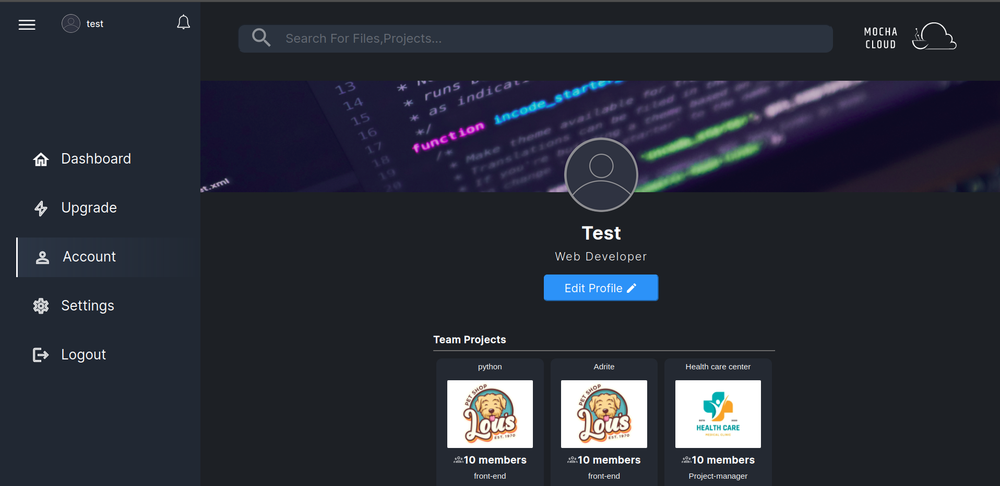

## More

**Available Routs:**

. `/` => landing page\
. `/auth` => authentication page\
. `/sign-up` => register new user\
. `/auth-confirm` => get users password for login\
. `/dashboard` => users dashboard and profile\
. `/discord-page` => discord server invitation link\
. `/plans` => our plans that user can buy as needed for more features\
. `/about-us` => about our mission and members of this project

We have one authentication page for both login and sign up (`/auth`) but if the user already had an account he/she will be navigated to `/auth-confirm` route to enter password, otherwise the sign up form will apear (`/sign-up`), and user is able to enter his/her info to be registred as a new user.

## Screens of each state in website

**Landing**

**Auth**

**Sign Up**

**Auth Confirm**

**Dashboard**

**Dasboard (After Creating A Project)**

**Plans**

**Account**

**Settings**

**Settings-Edit Info**

**Settings-Privacy And Security**

**Settings-Sessions**

# Getting Started with Create React App

This project was bootstrapped with [Create React App](https://github.com/facebook/create-react-app).

## Available Scripts

In the project directory, you can run:

## `npm start`

Runs the app in the development mode.\
Open [http://localhost:3000](http://localhost:3000) to view it in your browser.

The page will reload when you make changes.\
You may also see any lint errors in the console.

### `npm test`

Launches the test runner in the interactive watch mode.\
See the section about [running tests](https://facebook.github.io/create-react-app/docs/running-tests) for more information.

### `npm run build`

Builds the app for production to the `build` folder.\
It correctly bundles React in production mode and optimizes the build for the best performance.

The build is minified and the filenames include the hashes.\
Your app is ready to be deployed!

See the section about [deployment](https://facebook.github.io/create-react-app/docs/deployment) for more information.

### `npm run eject`

**Note: this is a one-way operation. Once you `eject`, you can't go back!**

If you aren't satisfied with the build tool and configuration choices, you can `eject` at any time. This command will remove the single build dependency from your project.

Instead, it will copy all the configuration files and the transitive dependencies (webpack, Babel, ESLint, etc) right into your project so you have full control over them. All of the commands except `eject` will still work, but they will point to the copied scripts so you can tweak them. At this point you're on your own.

You don't have to ever use `eject`. The curated feature set is suitable for small and middle deployments, and you shouldn't feel obligated to use this feature. However we understand that this tool wouldn't be useful if you couldn't customize it when you are ready for it.
